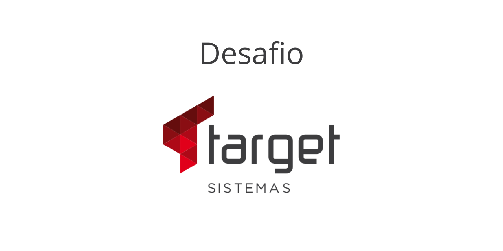
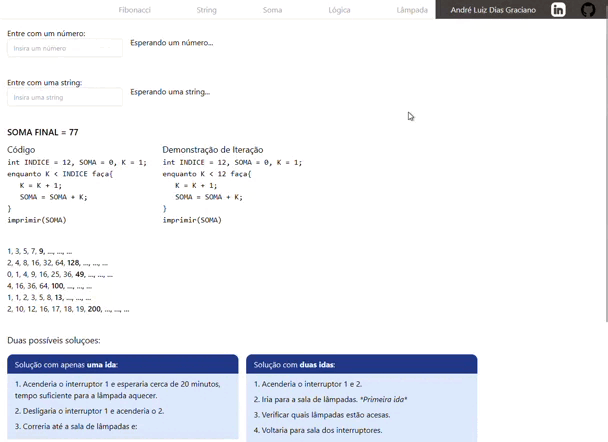

# Desafio Target Sistemas
D

## Tabela de Conteúdo

- [O Desafio](#o-desafio)
	- [Fibonacci](#fibonacci)
	- [String](#string)
	- [Loop](#loop)
	- [Sequência](#sequência)
	- [Raciocínio Lógico](#raciocínio-lógico)
- [A Aplicação](#a-aplicação)
	- [Tecnologias](#tecnologias)
	- [Layout Responsivo](#layout-responsivo)

# O Desafio

### Fibonacci

Dado a sequência de Fibonacci, onde se inicia por 0 e 1 e o próximo valor sempre será a soma dos 2 valores anteriores (exemplo: 0, 1, 1, 2, 3, 5, 8, 13, 21, 34...), escreva um programa na linguagem que desejar onde, informado um número, ele calcule a sequência de Fibonacci e retorne uma mensagem avisando se o número informado pertence ou não a sequência.

### String

Escreva um programa que verifique, em uma string, a existência da letra 'a', seja maiúscula ou minúscula, além de informar a quantidade de vezes em que ela ocorre.

### Loop

Observe o trecho de código abaixo: int INDICE = 12, SOMA = 0, K = 1; enquanto K < INDICE faça { K = K + 1; SOMA = SOMA + K; } imprimir(SOMA);

### Sequência

Descubra a lógica e complete o próximo elemento:
- **a)** 1, 3, 5, 7, ___
- **b)** 2, 4, 8, 16, 32, 64, ____
- **c)** 0, 1, 4, 9, 16, 25, 36, ____
- **d)** 4, 16, 36, 64, ____
- **e)** 1, 1, 2, 3, 5, 8, ____
- **f)** 2, 10, 12, 16, 17, 18, 19, ____

### Raciocínio Lógico

Você está em uma sala com três interruptores, cada um conectado a uma lâmpada em salas diferentes. Você não pode ver as lâmpadas da sala em que está, mas pode ligar e desligar os interruptores quantas vezes quiser. Seu objetivo é descobrir qual interruptor controla qual lâmpada. Como você faria para descobrir, usando apenas duas idas até uma das salas das lâmpadas, qual interruptor controla cada lâmpada?

# A Aplicação

## Tecnologias
- HTML
- CSS
- Javascript
- Tailwindcss
- Git e GitHub

## Layout Responsivo

Clique em `Play` no vídeo abaixo para ver como o layout da aplicação se adapta de forma responsiva.

